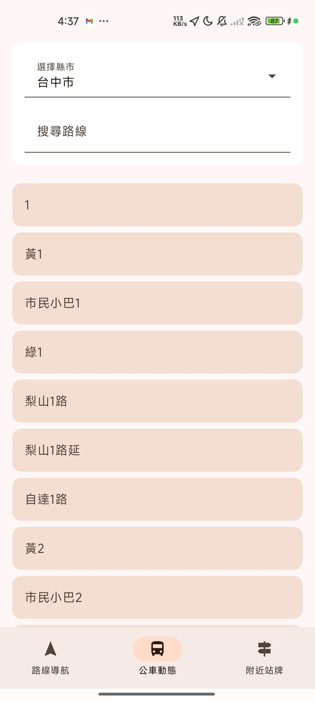
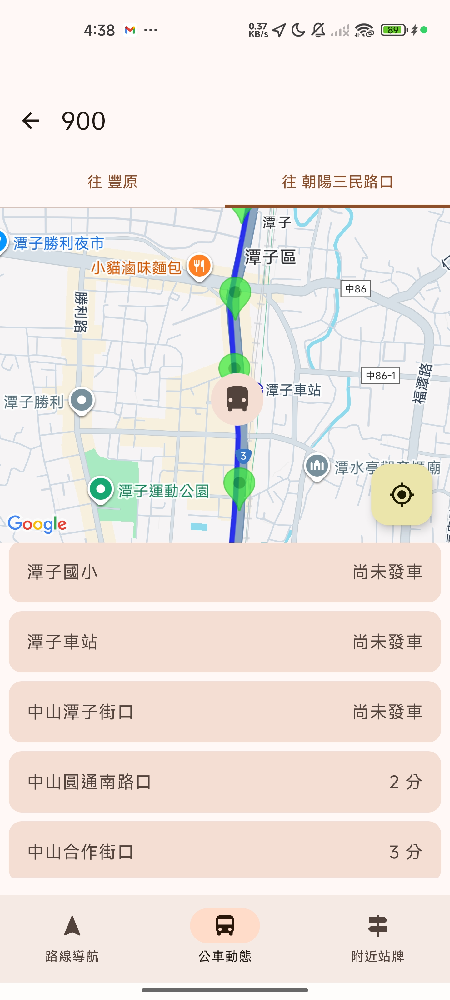
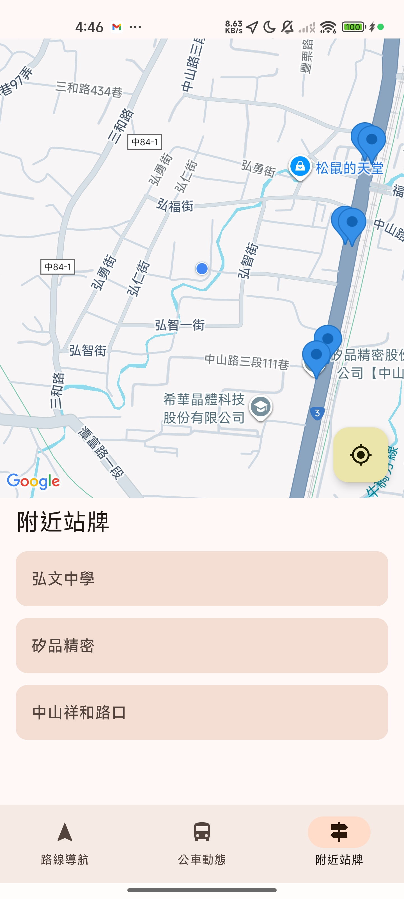
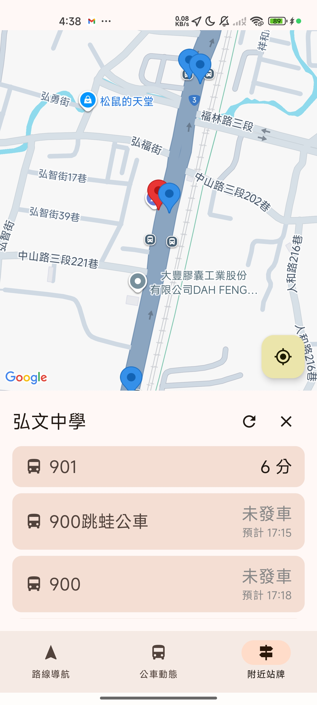
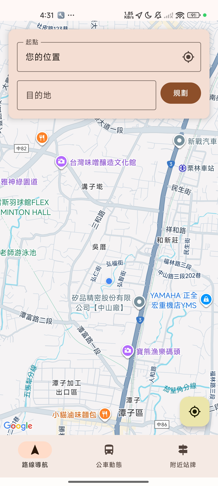
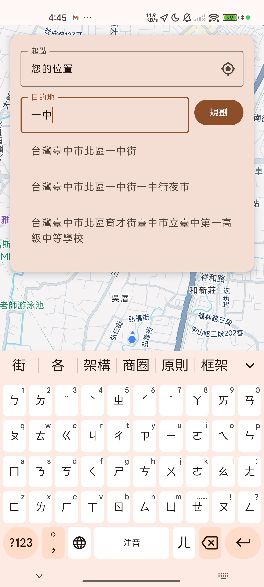
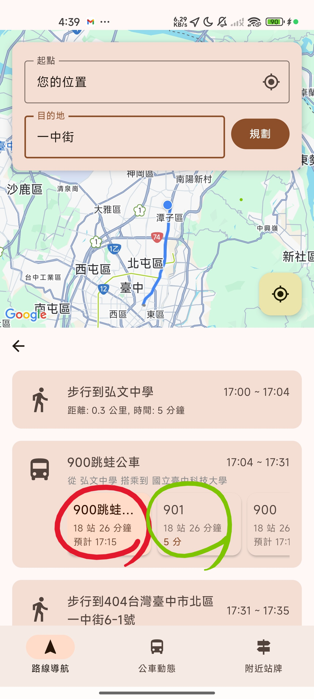
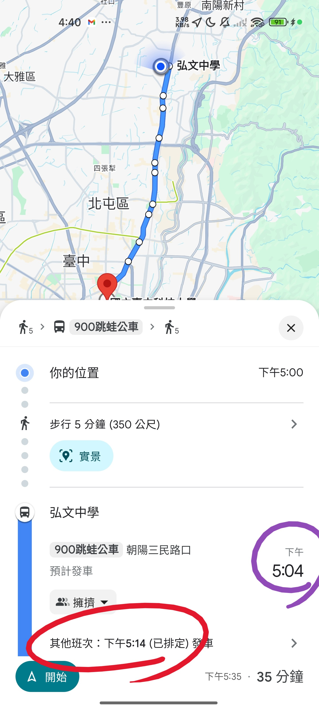
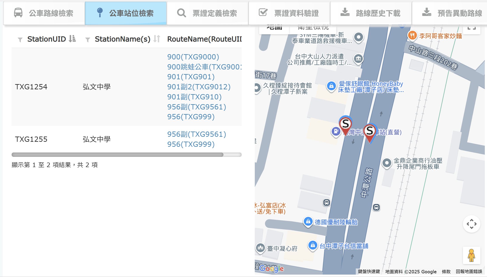

# 大眾運輸導航 App

這是一個整合Google map大眾運輸導航與即時公車資訊的 Android 應用程式。

## 專案介紹

本專案透過串接 [交通部運輸資料流通服務平臺 (TDX)](https://tdx.transportdata.tw/) 的 API，提供使用者查詢指定公車路線的預估到站時間與附近站牌公車動態。

主要目的是為了解決Google大眾運輸導航的公車到站時間不準確的問題，主要實做方式如下

1.Google提供路線規劃功能，並取得首末公車站座標(以下使用AB站牌代表)
2.透過座標對應到TDX api的StationID
3.使用StationID取得A站的所有公車資訊
4.透過A站的公車資訊，篩選出所有經過A站的公車路線途經的站牌是否包含B站
5.再將符合篩選的路線的公車即時到站時間顯示於列表ui上

## 主要功能

*   查詢指定路線公車動態

1.公車動態主頁
此頁面會自動定位選擇縣市，直接輸入路線名即可查詢路線詳情

2.公車動態地圖檢視頁面及各站牌預計到站時間

*   查詢附近公車站牌與預估到站時間

1.附近站牌主頁

2.附近站牌公車動態頁面

*   大眾運輸導航功能

1.大眾運輸導航功能主頁

2.目的地搜尋頁

## 專案特色功能介紹
*   與Google map大眾運輸規劃相比有什麼優勢?
使用實際的即時公車資訊搭配Google路徑規劃，可以避免Google導航上公車預計到站時間不準確的問題

如下圖圖中紅色與紫色圈起的部分為Google提供的公車搭乘路線，可以看到google在圖2中預計17:04分發車的900跳實際上在政府的資料中並沒有發車。
在這個情況下搭乘需等到17:14分，但在相同的首末AB兩車站之間，其實也可以搭乘預計5分鐘後到站的901

 

## 如何建置

1.  使用 Android Studio 開啟此專案。
2.  local.properties用於填寫api key。
3.  填寫完成後即可直接建置。

## 注意事項

1.全市站牌資料與公車站牌及路線為了節省api消耗，資料採用7天期限的機制

2.目前應用程式中因為交通部TDX api公車對應站牌資料在台中市的資料提供有問題，許多應該對應兩邊不同站牌的公車資料被歸屬到同一側，在附近站牌與導航功能內的「抓取某站牌即時公車資訊」的方式皆為一次讀取附近多個同名站牌的公車資訊，再比對有沒有站牌同時出現，如果在一個站牌的即時公車資訊中出現兩班同名不同方向的公車，就會進一步取得該路線的前後站牌，並使用方位角概念來區分來回兩個方向對應的站牌，此資料在本地儲存7天期限，期限內不用重新進行此資料比對

如下方圖片所示，TXG1254與TXG1255再實際狀態雙向的公車路線是相同的，因為交通部提供的資料問題導致900、900跳、901、901副、901副2 等5條公車路線只出現在其中一個站牌(TXG1254)，此情況會造成讀取TXG1255只能取得2班公車資料

此方法是為了因應台中市資料問題的暫時措施，在台中市實測可以正常運作，部分縣市如果有較特殊的公車規則可能會造成此方式無效